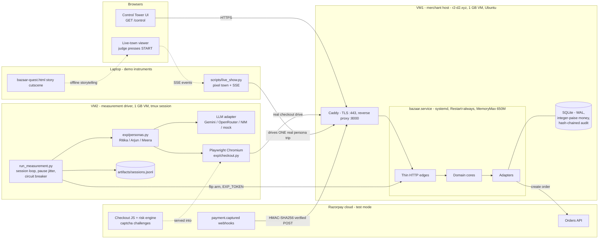
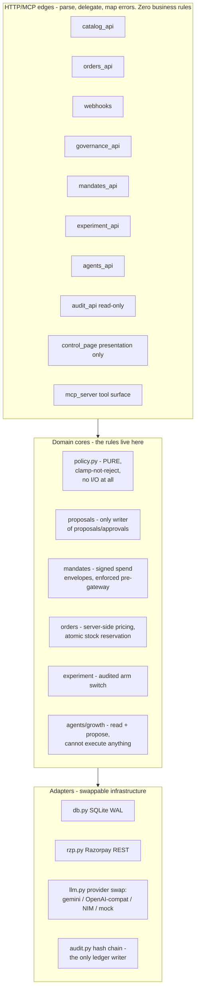
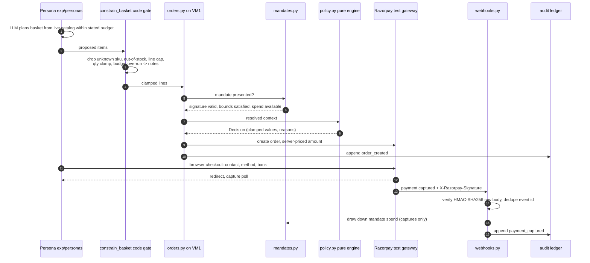
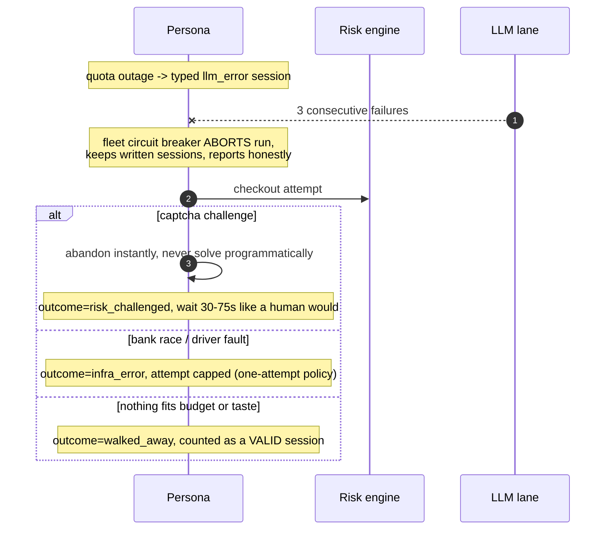
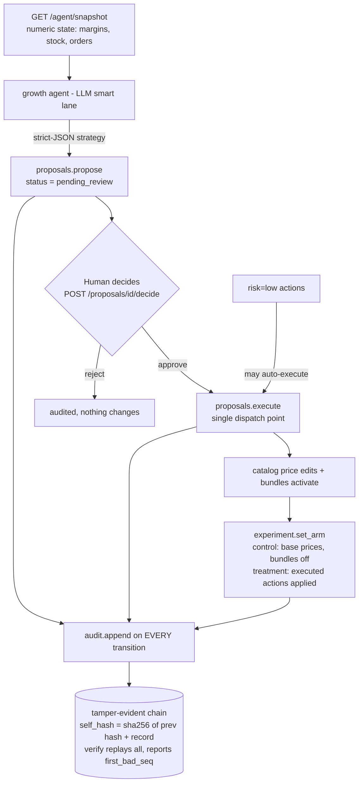

# ARCHITECTURE.md — system architecture with diagrams

Companion to [SOLUTION.md](SOLUTION.md) (what & why) and
[AGENT-DESIGN.md](AGENT-DESIGN.md) (the buyer agents in depth).

Two Azure VMs, zero paid services. **VM1** hosts the governed merchant
(`r2-d2.xyz`, systemd-managed, Caddy TLS). **VM2** is the measurement
driver that aims AI shoppers at it. Everything below maps to real modules
in `app/bazaar/*` (merchant core) and `app/exp/*` (demand side).

---

## 1. Deployment topology

## 2. Layering inside the merchant core (clean architecture)

Dependency direction is one-way and structural, not aspirational:

Invariants this buys us:

- **Client-sent amounts are never trusted** — `orders.py` prices every
  basket from the catalog server-side.
- **Money-affecting change has exactly one door** — `propose()` → human
  `decide` → `execute`; low-risk actions may auto-execute, everything else
  sits in `pending_review`.
- **The ledger has one writer** (`audit.append`) and one reader edge
  (`GET /audit/recent`, which replays the chain and returns
  `first_bad_seq`).
- **The growth agent cannot spend** — its pipeline ends at `propose()`,
  structurally.
- **MCP and REST share the same functions**, so the two surfaces can never
  drift apart.

## 3. Anatomy of one money action (paid-trip happy path)

Failure paths are first-class branches, not exceptions to hide:

## 4. Governance loop (how agent actions touch the storefront)

The same chain also records arm flips, mandate issuance/revocation,
webhook applications, and order/payment events — one timeline, any
dispute replayable.

## 5. Data & evidence plane

| Store | What lives there |
|---|---|
| SQLite (VM1) | products, orders, payments, proposals/approvals, mandates, bundles — integer paise throughout |
| Audit ledger (VM1) | append-only hash chain, 650+ records, `first_bad_seq: null` at last verification |
| `artifacts/sessions.jsonl` (VM2) | one JSON line per shopping trip: persona, LLM brain, verbatim analysis, basket + clamp notes, attempts, typed outcome |
| `PREREGISTRATION.md` | hypotheses + arms written before the run |
| `artifacts/sessions_final.jsonl` | the frozen n=94 dataset (41 paid / 30 risk_challenged / 18 llm_error / 5 infra_error) |

## 6. Operational posture

- **systemd**: `bazaar.service` with `Restart=always`, `RestartSec=3`,
  `MemoryMax=650M` on a 1 GB box; self-healing proven by controlled
  restart during the live period.
- **Caddy**: automatic TLS on `r2-d2.xyz`, proxying to uvicorn on
  localhost:8000.
- **Zero new dependencies**: Razorpay, Gemini/Groq/NIM calls are raw
  `httpx`; storage is SQLite; browser automation is Playwright — the only
  heavyweight, and it lives on the *driver* VM, not the merchant.
- **Keyless mode**: `LLM_PROVIDER=mock` runs the entire pipeline with no
  keys at all (rehearsal ids `ord_REHEARSAL…` can never masquerade as
  captured payments).
- **Secrets**: `.env` on the host only; `EXP_TOKEN` is minted on VM1 and
  piped to VM2 without ever being printed; webhook secret verified via
  HMAC before any state change.
